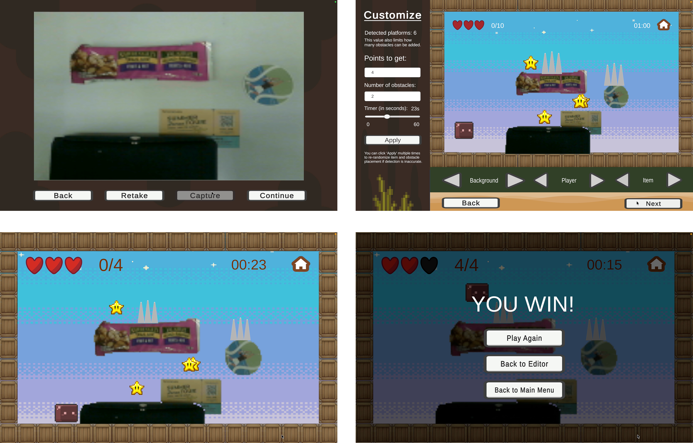
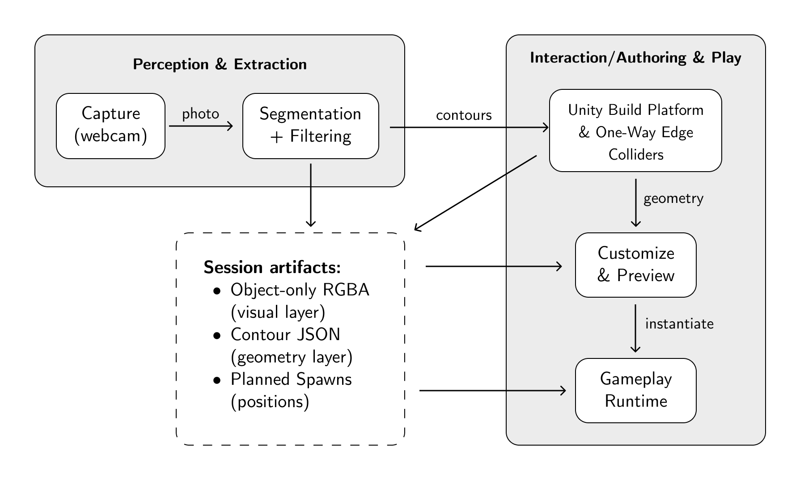

# Tactile Game Level Creator (TGLC)

Tactile Game Level Creator (TGLC) turns tabletop drawings and everyday objects into playable 2D platformer levels. Capture a scene, customize settings, then play the generated level in Unity. It aims to lower the barrier to level authoring for non-experts by using familiar hands-on interactions.



Demo video: https://drive.google.com/file/d/1St-wbC0KPDumuw-_we3f-Gaty572lLuQ/view?usp=sharing

## System Pipeline



1.	**Capture (webcam):** you take a photo of the physical tabletop layout.
2.	**Segmentation + filtering:** the perception step isolates the objects and extracts clean contours. It also produces session artifacts like an object-only RGBA (visual layer), a contour JSON (geometry layer), and planned spawn positions.
3.	**Unity build:** Unity consumes the contours/JSON to build the platform geometry and generate one-way edge colliders.
4.	**Customize & preview:** the system uses the same geometry plus the planned spawns so users can adjust visuals/gameplay and preview placement.
5.	**Gameplay runtime:** Unity instantiates the final level from those artifacts and runs the playable scene.


## Repository Layout
```text
.
├── images/
│   ├── tglc_pipeline.png
│   └── capture_customize_play.png
├── segmentation/
│   ├── .venv/                                 # local python environment
│   ├── fastsam_segmentation_for_unity.py
│   ├── models/
│   │   ├── FastSAM-x.pt (or FastSAM-s.pt)     # downloaded pretrained weights
│   └── archive/
│       ├── sam2_segmentation_for_unity.py
│       └── cv_segmentation_for_unity.py
└── unity/
    └── TactileGameLevelCreator/
        ├── Assets/
        ├── Packages/
        └── ProjectSettings/
```


## Setup and Run
1. Open the Unity project from: `unity/TactileGameLevelCreator`
2. Create a Python environment in `segmentation/`: `python3 -m venv segmentation/.venv`
3. Install dependencies: `segmentation/.venv/bin/python -m pip install ultralytics opencv-python pillow numpy`
4. Download `FastSAM-x.pt` or `FastSAM-s.pt` and place it at: `segmentation/models/`
   
   FastSAM pretrained weights: https://docs.ultralytics.com/models/fast-sam/#available-models-supported-tasks-and-operating-modes

5. In Unity (`Capture` scene), set:
   - `pythonExePath` -> absolute path to `segmentation/.venv/bin/python`
   - `segmenterScriptPath` -> absolute path to `segmentation/fastsam_segmentation_for_unity.py`
6. Run capture flow in Unity. Outputs are written to the run directory created by `CaptureController`.

## References
- FastSAM: https://github.com/CASIA-IVA-Lab/FastSAM
- Ultralytics: https://github.com/ultralytics/ultralytics
- SAM 2 (reference/archived comparison): https://github.com/facebookresearch/sam2
- OpenCV: https://opencv.org/
- Unity: https://unity.com/
